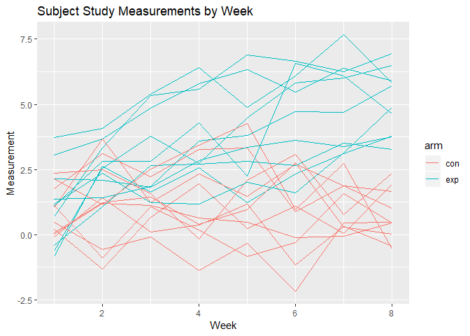

Homework 5
================
James Dalgleish
November 2, 2018

### Problem 1

To begin, we'll download the file, extract it's contents, and clean up the unnecessary files.

``` r
#Download and extract source data from zip archive.
download.file(url = "http://p8105.com/data/hw5_data.zip", 
              destfile =  "hw5_data.zip")
unzip(zipfile = "hw5_data.zip", exdir = "data", junkpaths = T) #extract the files into this new directory
study_csvs <- list.files(path = "data",pattern = "^.[A-z]*.*\\.csv$", full.names = T) #grab just the real CSVs beginning with a letter and ending with a .csv, avoiding unimportant files in the archive.

#delete the extra csvs and ._data in the __MACOSX folder of the archive.
#a setdiff will include the . and .., which we can't remove, so specific commands are needed.
if ( Sys.info()['sysname'] == "Windows") {
extra_files <- list.files('data',all.files = T, "^[.].*\\.csv$", full.names = T)
#grabs the files that are csv, but begin with a period (not the real datafiles).
file.remove(extra_files) #deletes these extra csvs.
file.remove("./data/._data") #deletes this extra ._data file.
file.remove("hw5_data.zip") #deletes the zip file
}
```

    ## [1] TRUE

Now that we have the raw data, we'll import it and convert the contents of the individual subject data into a comprehensive table in long format that is amenable to data analysis, incorporating information about the subject contained in the filename.

``` r
read_w_fn <- function(csv, basename = T) { #the basename argument ensures the function is more generalizable to future problems where the full file path is desired in the output (in which case the user can set this flag to false).
  #browser()
  if (basename) {
    
  df <- read_csv(csv) %>% #read in csv file.
    mutate(source_file = #add a column for filename from whence the rows came.
             basename(csv) #putting in a single value still allows for recycling.
           #So, this procedure will always work in this function.
              #https://cran.r-project.org/web/packages/dplyr/vignettes/dplyr.html
                 )
  } else {
    df <- read_csv(csv) %>% 
    mutate(source_file = csv) #this option just takes the filename as is, without removing directory structure.
  }
}
#test reading a file with the function:
#read_w_fn(study_csvs[1])

study_data <- study_csvs   %>%  #Creates a dataframe from the columns.
   map_df(.f = read_w_fn) %>% #reads in all the csvs and puts them together into a single dataframe by binding the rows together. 
  gather(key = "week", value = "measurement", starts_with("week")) %>%  #converts weeks to long format.
  mutate(week = (str_replace(week,"week_","") %>% 
           as.numeric()), #creates a numeric week variable
         arm = str_replace(basename(source_file),"_.*$",""), #creates a categorical arm variable by removing the text after con or exp.
         subject_id = (str_extract( #extracts the subject number from the filename.
           basename(source_file), #removes the directory information from the filename.
          pattern =  "(\\d)+") %>% #specifies the numbers within the filename as the string to be extracted.
                         as.numeric()) #converts subject ID to numeric
         ) 
```

    ## Parsed with column specification:
    ## cols(
    ##   week_1 = col_double(),
    ##   week_2 = col_double(),
    ##   week_3 = col_double(),
    ##   week_4 = col_double(),
    ##   week_5 = col_double(),
    ##   week_6 = col_double(),
    ##   week_7 = col_double(),
    ##   week_8 = col_double()
    ## )
    ## Parsed with column specification:
    ## cols(
    ##   week_1 = col_double(),
    ##   week_2 = col_double(),
    ##   week_3 = col_double(),
    ##   week_4 = col_double(),
    ##   week_5 = col_double(),
    ##   week_6 = col_double(),
    ##   week_7 = col_double(),
    ##   week_8 = col_double()
    ## )
    ## Parsed with column specification:
    ## cols(
    ##   week_1 = col_double(),
    ##   week_2 = col_double(),
    ##   week_3 = col_double(),
    ##   week_4 = col_double(),
    ##   week_5 = col_double(),
    ##   week_6 = col_double(),
    ##   week_7 = col_double(),
    ##   week_8 = col_double()
    ## )
    ## Parsed with column specification:
    ## cols(
    ##   week_1 = col_double(),
    ##   week_2 = col_double(),
    ##   week_3 = col_double(),
    ##   week_4 = col_double(),
    ##   week_5 = col_double(),
    ##   week_6 = col_double(),
    ##   week_7 = col_double(),
    ##   week_8 = col_double()
    ## )
    ## Parsed with column specification:
    ## cols(
    ##   week_1 = col_double(),
    ##   week_2 = col_double(),
    ##   week_3 = col_double(),
    ##   week_4 = col_double(),
    ##   week_5 = col_double(),
    ##   week_6 = col_double(),
    ##   week_7 = col_double(),
    ##   week_8 = col_double()
    ## )
    ## Parsed with column specification:
    ## cols(
    ##   week_1 = col_double(),
    ##   week_2 = col_double(),
    ##   week_3 = col_double(),
    ##   week_4 = col_double(),
    ##   week_5 = col_double(),
    ##   week_6 = col_double(),
    ##   week_7 = col_double(),
    ##   week_8 = col_double()
    ## )
    ## Parsed with column specification:
    ## cols(
    ##   week_1 = col_double(),
    ##   week_2 = col_double(),
    ##   week_3 = col_double(),
    ##   week_4 = col_double(),
    ##   week_5 = col_double(),
    ##   week_6 = col_double(),
    ##   week_7 = col_double(),
    ##   week_8 = col_double()
    ## )
    ## Parsed with column specification:
    ## cols(
    ##   week_1 = col_double(),
    ##   week_2 = col_double(),
    ##   week_3 = col_double(),
    ##   week_4 = col_double(),
    ##   week_5 = col_double(),
    ##   week_6 = col_double(),
    ##   week_7 = col_double(),
    ##   week_8 = col_double()
    ## )
    ## Parsed with column specification:
    ## cols(
    ##   week_1 = col_double(),
    ##   week_2 = col_double(),
    ##   week_3 = col_double(),
    ##   week_4 = col_double(),
    ##   week_5 = col_double(),
    ##   week_6 = col_double(),
    ##   week_7 = col_double(),
    ##   week_8 = col_double()
    ## )
    ## Parsed with column specification:
    ## cols(
    ##   week_1 = col_double(),
    ##   week_2 = col_double(),
    ##   week_3 = col_double(),
    ##   week_4 = col_double(),
    ##   week_5 = col_double(),
    ##   week_6 = col_double(),
    ##   week_7 = col_double(),
    ##   week_8 = col_double()
    ## )
    ## Parsed with column specification:
    ## cols(
    ##   week_1 = col_double(),
    ##   week_2 = col_double(),
    ##   week_3 = col_double(),
    ##   week_4 = col_double(),
    ##   week_5 = col_double(),
    ##   week_6 = col_double(),
    ##   week_7 = col_double(),
    ##   week_8 = col_double()
    ## )
    ## Parsed with column specification:
    ## cols(
    ##   week_1 = col_double(),
    ##   week_2 = col_double(),
    ##   week_3 = col_double(),
    ##   week_4 = col_double(),
    ##   week_5 = col_double(),
    ##   week_6 = col_double(),
    ##   week_7 = col_double(),
    ##   week_8 = col_double()
    ## )
    ## Parsed with column specification:
    ## cols(
    ##   week_1 = col_double(),
    ##   week_2 = col_double(),
    ##   week_3 = col_double(),
    ##   week_4 = col_double(),
    ##   week_5 = col_double(),
    ##   week_6 = col_double(),
    ##   week_7 = col_double(),
    ##   week_8 = col_double()
    ## )

    ## Parsed with column specification:
    ## cols(
    ##   week_1 = col_double(),
    ##   week_2 = col_double(),
    ##   week_3 = col_double(),
    ##   week_4 = col_double(),
    ##   week_5 = col_double(),
    ##   week_6 = col_double(),
    ##   week_7 = col_integer(),
    ##   week_8 = col_double()
    ## )

    ## Parsed with column specification:
    ## cols(
    ##   week_1 = col_double(),
    ##   week_2 = col_double(),
    ##   week_3 = col_double(),
    ##   week_4 = col_double(),
    ##   week_5 = col_double(),
    ##   week_6 = col_double(),
    ##   week_7 = col_double(),
    ##   week_8 = col_double()
    ## )
    ## Parsed with column specification:
    ## cols(
    ##   week_1 = col_double(),
    ##   week_2 = col_double(),
    ##   week_3 = col_double(),
    ##   week_4 = col_double(),
    ##   week_5 = col_double(),
    ##   week_6 = col_double(),
    ##   week_7 = col_double(),
    ##   week_8 = col_double()
    ## )
    ## Parsed with column specification:
    ## cols(
    ##   week_1 = col_double(),
    ##   week_2 = col_double(),
    ##   week_3 = col_double(),
    ##   week_4 = col_double(),
    ##   week_5 = col_double(),
    ##   week_6 = col_double(),
    ##   week_7 = col_double(),
    ##   week_8 = col_double()
    ## )
    ## Parsed with column specification:
    ## cols(
    ##   week_1 = col_double(),
    ##   week_2 = col_double(),
    ##   week_3 = col_double(),
    ##   week_4 = col_double(),
    ##   week_5 = col_double(),
    ##   week_6 = col_double(),
    ##   week_7 = col_double(),
    ##   week_8 = col_double()
    ## )
    ## Parsed with column specification:
    ## cols(
    ##   week_1 = col_double(),
    ##   week_2 = col_double(),
    ##   week_3 = col_double(),
    ##   week_4 = col_double(),
    ##   week_5 = col_double(),
    ##   week_6 = col_double(),
    ##   week_7 = col_double(),
    ##   week_8 = col_double()
    ## )
    ## Parsed with column specification:
    ## cols(
    ##   week_1 = col_double(),
    ##   week_2 = col_double(),
    ##   week_3 = col_double(),
    ##   week_4 = col_double(),
    ##   week_5 = col_double(),
    ##   week_6 = col_double(),
    ##   week_7 = col_double(),
    ##   week_8 = col_double()
    ## )

Instructions: Tidy the result; manipulate file names to include control arm and subject ID, make sure weekly observations are “tidy”, and do any other tidying that’s necessary Make a spaghetti plot showing observations on each subject over time, and comment on differences between groups.

``` r
spaghetti_con_exp <- ggplot(data = study_data, 
                            aes(x = week, y = measurement, color = arm, group = subject_id)) +
  geom_line()
spaghetti_con_exp #For some reason, base ggplot won't piece this together correctly.
```



``` r
#plotly::ggplotly(p = spaghetti_con_exp)  #it works absolutely fine in plotly.
```

### Problem 2

Now, we'll grab homicide data for analysis.

``` r
homicide_data <- read_csv("https://raw.githubusercontent.com/washingtonpost/data-homicides/master/homicide-data.csv") %>% #read in data.
  mutate( victim_first = iconv(x = victim_first, from = "latin1", to =  "ASCII",sub = ""),
          victim_last = iconv(x = victim_last, from = "latin1", to =  "ASCII",sub = ""),
          #This removes nonstandard characters that cause problems with skimr.
          city_state = str_c(city,", ",state), #create city state variable by string concatenation.
          unresolved = disposition %in% c("Closed without arrest","Open/No arrest"),
          #creates a variable for whether the case was  unresolved.
          resolved = disposition %in% c("Closed by arrest")) 
```

    ## Parsed with column specification:
    ## cols(
    ##   uid = col_character(),
    ##   reported_date = col_integer(),
    ##   victim_last = col_character(),
    ##   victim_first = col_character(),
    ##   victim_race = col_character(),
    ##   victim_age = col_character(),
    ##   victim_sex = col_character(),
    ##   city = col_character(),
    ##   state = col_character(),
    ##   lat = col_double(),
    ##   lon = col_double(),
    ##   disposition = col_character()
    ## )

``` r
#creates a variable for whether the case was resolved, to double check the numbers.
#Included the resolved cases as a separate variable to clearly show that the resolved and unresolved cases sum to the total (and hence the calculations make sense).
hom_summ_tbl <- homicide_data %>% 
  group_by(city_state) %>%  
  summarise(total = n(), #get the total number of cases by city_state combination.
            unresolved_cases = sum(unresolved), 
        #Gets the unresolved cases of each city state combination.
            resolved_cases = sum(resolved)
        #Gets the resolved cases of each city state combination.
            ) %>% 
  select(city_state, unresolved_cases, resolved_cases, total) 
  #rearranges the columns

 hom_summ_tbl %>% 
  knitr::kable(col.names = c("City, State", "Unresolved Cases", "Resolved Cases", "Total Cases"), format = "markdown", padding = 10) #Displays the table in a more presentable format.
```

| City, State        |  Unresolved Cases|  Resolved Cases|  Total Cases|
|:-------------------|-----------------:|---------------:|------------:|
| Albuquerque, NM    |               146|             232|          378|
| Atlanta, GA        |               373|             600|          973|
| Baltimore, MD      |              1825|            1002|         2827|
| Baton Rouge, LA    |               196|             228|          424|
| Birmingham, AL     |               347|             453|          800|
| Boston, MA         |               310|             304|          614|
| Buffalo, NY        |               319|             202|          521|
| Charlotte, NC      |               206|             481|          687|
| Chicago, IL        |              4073|            1462|         5535|
| Cincinnati, OH     |               309|             385|          694|
| Columbus, OH       |               575|             509|         1084|
| Dallas, TX         |               754|             813|         1567|
| Denver, CO         |               169|             143|          312|
| Detroit, MI        |              1482|            1037|         2519|
| Durham, NC         |               101|             175|          276|
| Fort Worth, TX     |               255|             294|          549|
| Fresno, CA         |               169|             318|          487|
| Houston, TX        |              1493|            1449|         2942|
| Indianapolis, IN   |               594|             728|         1322|
| Jacksonville, FL   |               597|             571|         1168|
| Kansas City, MO    |               486|             704|         1190|
| Las Vegas, NV      |               572|             809|         1381|
| Long Beach, CA     |               156|             222|          378|
| Los Angeles, CA    |              1106|            1151|         2257|
| Louisville, KY     |               261|             315|          576|
| Memphis, TN        |               483|            1031|         1514|
| Miami, FL          |               450|             294|          744|
| Milwaukee, wI      |               403|             712|         1115|
| Minneapolis, MN    |               187|             179|          366|
| Nashville, TN      |               278|             489|          767|
| New Orleans, LA    |               930|             504|         1434|
| New York, NY       |               243|             384|          627|
| Oakland, CA        |               508|             439|          947|
| Oklahoma City, OK  |               326|             346|          672|
| Omaha, NE          |               169|             240|          409|
| Philadelphia, PA   |              1360|            1677|         3037|
| Phoenix, AZ        |               504|             410|          914|
| Pittsburgh, PA     |               337|             294|          631|
| Richmond, VA       |               113|             316|          429|
| Sacramento, CA     |               139|             237|          376|
| San Antonio, TX    |               357|             476|          833|
| San Bernardino, CA |               170|             105|          275|
| San Diego, CA      |               175|             286|          461|
| San Francisco, CA  |               336|             327|          663|
| Savannah, GA       |               115|             131|          246|
| St. Louis, MO      |               905|             772|         1677|
| Stockton, CA       |               266|             178|          444|
| Tampa, FL          |                95|             113|          208|
| Tulsa, AL          |                 0|               1|            1|
| Tulsa, OK          |               193|             390|          583|
| Washington, DC     |               589|             756|         1345|

``` r
#The numbers add up: unresolved + resolved = total.
 library(magrittr)
```

    ## 
    ## Attaching package: 'magrittr'

    ## The following object is masked from 'package:purrr':
    ## 
    ##     set_names

    ## The following object is masked from 'package:tidyr':
    ## 
    ##     extract

``` r
 balt_res <- hom_summ_tbl %>%
   filter(city_state == "Baltimore, MD") %>% 
   select(unresolved_cases, total) %>% 
   rowwise() %$% 
   prop.test(x = unresolved_cases, n = total)
 balt_res %>% 
   broom::tidy() 
```

    ## # A tibble: 1 x 8
    ##   estimate statistic  p.value parameter conf.low conf.high method
    ##      <dbl>     <dbl>    <dbl>     <int>    <dbl>     <dbl> <chr> 
    ## 1    0.646      239. 6.46e-54         1    0.628     0.663 1-sam~
    ## # ... with 1 more variable: alternative <chr>

``` r
 #   select(unresolved_cases, total) %>% 
 #   map(prop.test)
   prop.test(hom_summ_tbl$unresolved_cases,hom_summ_tbl$total)
```

    ## Warning in prop.test(hom_summ_tbl$unresolved_cases, hom_summ_tbl$total):
    ## Chi-squared approximation may be incorrect

    ## 
    ##  51-sample test for equality of proportions without continuity
    ##  correction
    ## 
    ## data:  hom_summ_tbl$unresolved_cases out of hom_summ_tbl$total
    ## X-squared = 2857.1, df = 50, p-value < 2.2e-16
    ## alternative hypothesis: two.sided
    ## sample estimates:
    ##    prop 1    prop 2    prop 3    prop 4    prop 5    prop 6    prop 7 
    ## 0.3862434 0.3833505 0.6455607 0.4622642 0.4337500 0.5048860 0.6122841 
    ##    prop 8    prop 9   prop 10   prop 11   prop 12   prop 13   prop 14 
    ## 0.2998544 0.7358627 0.4452450 0.5304428 0.4811742 0.5416667 0.5883287 
    ##   prop 15   prop 16   prop 17   prop 18   prop 19   prop 20   prop 21 
    ## 0.3659420 0.4644809 0.3470226 0.5074779 0.4493192 0.5111301 0.4084034 
    ##   prop 22   prop 23   prop 24   prop 25   prop 26   prop 27   prop 28 
    ## 0.4141926 0.4126984 0.4900310 0.4531250 0.3190225 0.6048387 0.3614350 
    ##   prop 29   prop 30   prop 31   prop 32   prop 33   prop 34   prop 35 
    ## 0.5109290 0.3624511 0.6485356 0.3875598 0.5364308 0.4851190 0.4132029 
    ##   prop 36   prop 37   prop 38   prop 39   prop 40   prop 41   prop 42 
    ## 0.4478103 0.5514223 0.5340729 0.2634033 0.3696809 0.4285714 0.6181818 
    ##   prop 43   prop 44   prop 45   prop 46   prop 47   prop 48   prop 49 
    ## 0.3796095 0.5067873 0.4674797 0.5396541 0.5990991 0.4567308 0.0000000 
    ##   prop 50   prop 51 
    ## 0.3310463 0.4379182
